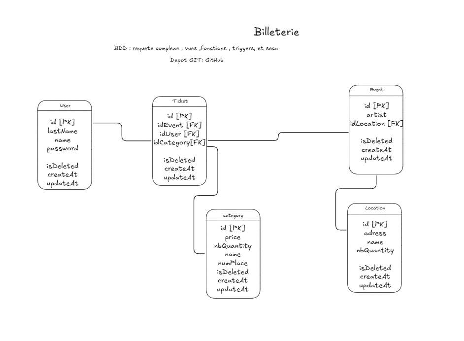

# ticketMaster



Application de billeterie : front Node.js/Express + base MySQL (requetes complexes, vues, fonctions/procedures, triggers, securite via des utilisateurs SQL dedies).

## Structure

- `db/init/` : scripts SQL executes automatiquement au premier demarrage du conteneur MySQL
  - `01_schema.sql` : tables (`users`, `location`, `event`, `category`, `ticket`)
  - `02_seed.sql` : donnees de demonstration (utilisateur de test : name=`Jean`, password=`password123`)
  - `03_views.sql` : vues (`v_ticket_details`, `v_category_availability`, `v_event_summary`)
  - `04_functions.sql` : fonctions (`fn_available_seats`, `fn_event_revenue`) et procedure `sp_buy_ticket`
  - `05_triggers.sql` : triggers (controle des places disponibles, suppression logique en cascade)
  - `06_security.sql` : utilisateurs SQL avec droits restreints (`app_user`, `report_user`)
  - `07_example_queries.sql` : exemples de requetes complexes (reference)
- `app/` : front Node.js (Express + EJS) qui consomme la base via l'utilisateur `app_user`

## Lancer le projet

```bash
docker compose up --build
```

Puis ouvrir http://localhost:3000

## Notes

- La base est initialisee uniquement au premier demarrage (volume `db_data` vide). Pour repartir de zero : `docker compose down -v`.
- Le mot de passe utilisateur est hashe (bcrypt) cote application avant d'etre stocke en base.
- `app_user` n'a pas les droits de suppression ni de DDL ; `report_user` n'a acces qu'aux vues de reporting.
