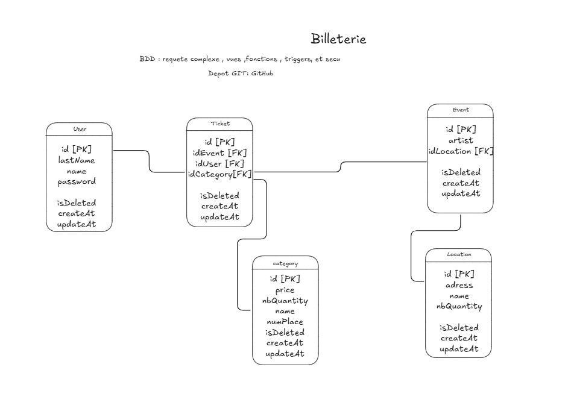

# ticketMaster



Plateforme de billetterie de concerts bâtie sur **deux familles de bases de données** :

- **MySQL 8** (relationnel) : utilisateurs, salles, événements, catégories, stock et billets — transactions, contraintes, vues, procédures, triggers.
- **MongoDB 7** (document) : contenu éditorial des événements (programme, tags, infos pratiques), avis et journal d'activité (TTL).

Une **API REST JSON** (Node.js / Express) et un **front web** (EJS) consomment les deux bases ; plusieurs endpoints croisent MySQL et MongoDB.

📄 [Document de présentation](docs/presentation.md) (architecture, MCD/MLD/MPD, modèle MongoDB, justification des choix, requêtes, index, sauvegarde) · 🎬 [Vidéo de présentation](docs/video/) · 🎞️ [Plan de la vidéo](docs/video/PLAN.md)

## Prérequis

- Docker Desktop (ou Docker Engine + plugin Compose v2), ports libres : `3000`, `3306`, `27017`.
- Rien d'autre : pas de Node, MySQL ni MongoDB à installer.

## Démarrage (une seule commande)

```bash
docker compose up --build
```

Au premier lancement (≈ 1 à 2 minutes) la pile :
1. démarre MySQL et exécute `docker/init-sql/*` (schéma, ~24 000 billets, vues, fonctions, triggers, rôles) ;
2. démarre MongoDB et exécute `docker/init-nosql/01_init.js` (collections, validateurs, index, utilisateur) ;
3. lance le job `seed` qui peuple MongoDB (300 contenus, ~7 000 avis, 8 000 activités) à partir des données MySQL ;
4. démarre l'API et le front.

Les valeurs de démonstration par défaut permettent de lancer la pile sans configuration. Pour personnaliser les mots de passe : `cp .env.example .env` puis éditer (le `.env` n'est jamais versionné).

| Service | URL |
|---|---|
| Front web | http://localhost:3000 |
| API REST | http://localhost:3000/api (santé : `/api/health`) |
| MySQL | `localhost:3306` (base `billeterie`) |
| Adminer (interface MySQL) | http://localhost:8080 — serveur `mysql`, utilisateur `root`, mot de passe `demo_root_pwd`, base `billeterie` |
| MongoDB | `localhost:27017` (base `ticketmaster`) |

**Comptes de démonstration** (mot de passe `password123`) : `jean@example.com`, `alice@example.com` (utilisateurs), `admin@ticketmaster.local` (administrateur).

**Repartir de zéro** : `docker compose down -v && docker compose up --build`.

### Vérifier le contenu chargé

```bash
# MySQL
docker compose exec mysql sh -c 'mysql -uroot -p"$MYSQL_ROOT_PASSWORD" billeterie -e "SELECT COUNT(*) FROM ticket; SELECT * FROM v_show_event LIMIT 3;"'
# MongoDB
docker compose exec mongo mongosh -u mongo_root -p demo_mongo_root_pwd --authenticationDatabase admin ticketmaster \
  --eval 'db.event_content.countDocuments(); db.reviews.countDocuments(); db.activity_log.countDocuments()'
# Tests d'intégration (11 tests sur la pile en marche)
docker compose exec api npm test
```

(Si vous avez défini un `.env`, remplacez `demo_mongo_root_pwd` par votre `MONGO_ROOT_PASSWORD`.)

## Structure du dépôt

```
README.md
docker-compose.yml          pile complète (mysql, mongo, seed, api)
.env.example                variables d'environnement (sans secret réel)
docker/
  init-sql/                 01 schéma · 02 peuplement · 03 vues · 04 fonctions/procédures · 05 triggers · 06 rôles
  init-nosql/               01_init.js : collections, validateurs $jsonSchema, index, TTL, utilisateur
  backup.sh, restore.sh     sauvegarde / restauration des deux bases
api/                        API REST + front EJS (Node.js, Express)
  server.js · src/routes (api.js, web.js) · src/services (sql, content, cross) · src/views
  scripts/seed-mongo.js     peuplement de MongoDB (job `seed`)
  test/api.test.js          tests d'intégration
docs/
  presentation.md           document de présentation
  sql/ queries.sql, explain_index.sql     requêtes et mesure EXPLAIN avant/après
  nosql_queries.js          requêtes MongoDB
  video/                    vidéo + plan
```

Le front est servi par le même conteneur que l'API (rendu serveur) : il n'y a donc pas de dossier `front/` séparé.

## Endpoints principaux

`MySQL` = base relationnelle · `Mongo` = base documentaire · `Croisé` = les deux. 🔒 = connexion requise, 👑 = administrateur.

| Méthode & route | Base | Description |
|---|---|---|
| `POST /api/auth/register` · `/login` · `/logout` | MySQL | inscription (bcrypt), connexion par session |
| `GET/PUT/DELETE /api/me` 🔒 | MySQL | profil (suppression logique) |
| `GET /api/events?q=&city=&upcoming=&sort=&page=&limit=` | MySQL | catalogue paginé (vue `v_show_event`) |
| `GET /api/events/:id` | MySQL | événement + catégories et stock |
| `POST/PUT/DELETE /api/events[/:id]` 👑 | MySQL (+Mongo) | CRUD événement ; `DELETE` purge aussi MongoDB |
| `GET /api/locations` · `POST /api/locations` 👑 | MySQL | salles |
| `POST /api/events/:id/tickets` 🔒 | MySQL | achat (procédure `sp_buy_ticket`) |
| `GET /api/me/tickets` 🔒 · `DELETE /api/tickets/:id` 🔒 | MySQL | mes billets · annulation |
| `GET/PUT/DELETE /api/events/:id/content` (PUT/DELETE 👑) | Mongo | contenu éditorial |
| `GET /api/content/search?q=&genre=&tag=&performer=&minRating=&maxAge=` | Mongo | recherche texte + filtres imbriqués |
| `GET/POST /api/events/:id/reviews` (POST 🔒) | Croisé | avis (POST : exige un billet MySQL) ; auteurs lus dans MySQL |
| `PUT/DELETE /api/events/:id/reviews/me` 🔒 | Mongo | modifier / supprimer mon avis |
| `GET /api/events/:id/rating-distribution` | Mongo | répartition des notes (`$group`) |
| `GET /api/events/:id/full` | **Croisé** | fiche complète : stock MySQL + contenu MongoDB |
| `GET /api/stats/top-events` · `/trending` | **Croisé** | classements MongoDB enrichis par MySQL |
| `GET /api/stats/sql/revenue-by-city` · `top-buyers` · `unsold-events` · `premium-categories` · `sales-per-day` | MySQL | agrégats, CTE, `NOT EXISTS`, sous-requêtes |
| `GET /api/stats/mongo/genres` | Mongo | pipeline d'agrégation par genre |

Les erreurs sont renvoyées en JSON `{ "error": "…" }` avec le bon code : `400` données invalides, `401` non connecté, `403` droits insuffisants, `404` ressource absente, `409` conflit (stock épuisé, doublon).

```bash
# Exemple : fiche croisée MySQL + MongoDB
curl http://localhost:3000/api/events/1/full
# Exemple : achat
curl -c c.txt -H 'Content-Type: application/json' -d '{"email":"alice@example.com","password":"password123"}' http://localhost:3000/api/auth/login
curl -b c.txt -H 'Content-Type: application/json' -d '{"categoryId":2}' http://localhost:3000/api/events/1/tickets
```

## Sauvegarde

```bash
./docker/backup.sh                          # -> backups/<horodatage>/{mysql.sql, mongo.archive.gz}
./docker/restore.sh backups/<horodatage>
```

Détails dans la section 8 du [document de présentation](docs/presentation.md).

## Outils d'IA utilisés

Ce projet a été développé avec l'assistance de **Claude Code** (Anthropic) pour le front et la documentation

## Notes

- Les scripts d'initialisation ne s'exécutent qu'au **premier** démarrage (volumes vides).
- Le mot de passe est haché (bcrypt) côté API ; l'application se connecte à MySQL avec `app_user` (droits limités) et à MongoDB avec un utilisateur `readWrite` sur une seule base — jamais en superutilisateur.
